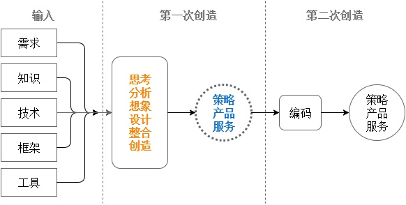

## 程序员的四种定位

- 解决某类问题
  - 开会
  - 异地办公
  - 食品安全
- 技术传播与布道
- 技术专家
  - C++
  - Go
- 架构与设计
  - 电商平台
  - APP

## 技术方向的选择

- 首先定位自己
- 查看市场薪资水平
- 考量技术前景

## 保持技术精进的常见途径

- 读书/视频课程
- 阅读源码
- 以战养战，在项目中使用新技术
- 加入开源项目
- 尝试进入高手的社群

新技术学个大概，用20%的精力知道80%的主要内容，用到时在进行深度学习。

## 真的做不到顶尖，怎么办

- 心态问题
- 寻找新环境
- 生活多元化
- 尝试第二职业

## 简单实用的职业规划策略

- 找到目标，分析现状，找到通路
- 从公司晋升体系找目标和途径

## 找不要转管理

开发转管理的常见方式

1. 开发-->技术优势-->负责项目-->技术管理
2. 开发-->发展组织、协调、管理等能力，主动承担相关工作，帮助领导分担管理工作-->有新项目时，担任项目管理角色-->技术管理
3. 开发-->发展组织、协调、管理等能力，PMP证书，联系实际开发中的项目管理-->应聘其它公司的管理职位
4. 大公司开发-->小公司项目管理角色

如何做准备
1. 业余时间学习知识
2. 把自己的事作为管理项目
3. 换位思考，常常把自己放在管理者的位置上进行思考

## 大龄程序员的未来在哪里

形成自己的思维框架，这是大龄程序员的优势。方便知识迁移。

进行业务上知识的积累。

进入中大型的公司。

另一个方法是看淡工作。

或者进入小公司。

或者转其他职业。

## 错过了校招还有机会进入大公司吗

有
1. 在小公司中成为比较牛的人
2. 掌握大公司需要的前瞻技术
3. 大公司社招

## 生活与工作的平衡

平衡是一种取舍，了解自己的需求，自己需求的优先级。

> 参考链接
> 
> [程序员，你的职场可以不迷茫](https://www.zhihu.com/lives/824624741653581824)