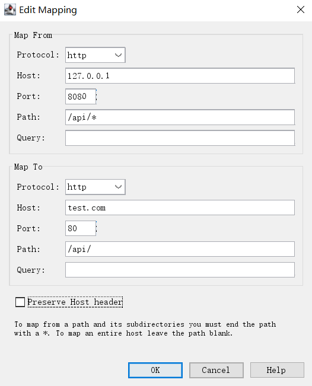

# charles本地调试之map功能

## map功能介绍
 map功能，顾名思义就是将某个请求进行重定向，用重定向后的内容来响应请求的内容；
map功能分为**map Local**和**map Remote**, 二者区分是：

- **map Local**：是将某个网络请求重定向到本地的某个文件
- **map Remote**：是将某个网络请求重定向到另一个网络请求

二者除了重定向文件的位置不同之外，其他功能都是一样的。他们都可以对js、css、html以及api接口均可重定向，此外也可以使用通配符来进行简单的批量匹配，达到批量重定向的目的。

## 实例
这里介绍一下我最常用的功能**api重定向**

为了mock数据；一般使用**map Remote**功能来将本地的请求重定向到测试或者线上环境的网络请求。
 
 例子如下:
``` bash
http://127.0.0.1:8080/api/foo/bar ---> http://test.com/api/foo/bar
```
配置如下


>注意上面map From中的Path配置项使用了`*`通配符，表示匹配127.0.0.1:8080/api/下的所有文件及子路径，将其重定向到test.com下的/api/路径下

## map通配符
map隐射可以使用的模式匹配符有三种：
- `*`: 可以匹配0个或者多个字符

- `?`: 可以匹配一个字符

-  `[...]`: 范围选择符，可以匹配范围中的任意一个字符

## map配置实例
假设`Map From`配置中的各个项为空，表示匹配所有请求，然后`Map To`项的配置不同，代表不同含义，下表列出一个简单例子

| Host配置值|     Path配置值|   配置产生的结果|
| :-------- |  :--------| :------ |
| charlesproxy.com|   |  匹配所有的请求重定向到charlesproxy.com主机|
| *.charlesproxy.com|   |  匹配所有的请求重定向到以.charlesproxy.com结尾的主机|
| charlesproxy.com| /charles/  |  匹配所有请求只重定向到charlesproxy.com/charles/路径下|
| charlesproxy.com| /charles/*  |  匹配所有请求只重定向到charlesproxy.com/charles/路径下,包括路径下的文件及其路径的子路径|
| charlesproxy.com|  /charles |  匹配所有请求只重定向到charlesproxy.com/charles下|
| charlesproxy.com|  /index.html |  匹配所有请求重定向到charlesproxy.com/index.html|
| |  /charles/*.html |  匹配所有请求重定向到任意主机下的以.html结尾的文件，该文件存放在主机的/charles/及其子目录下|

