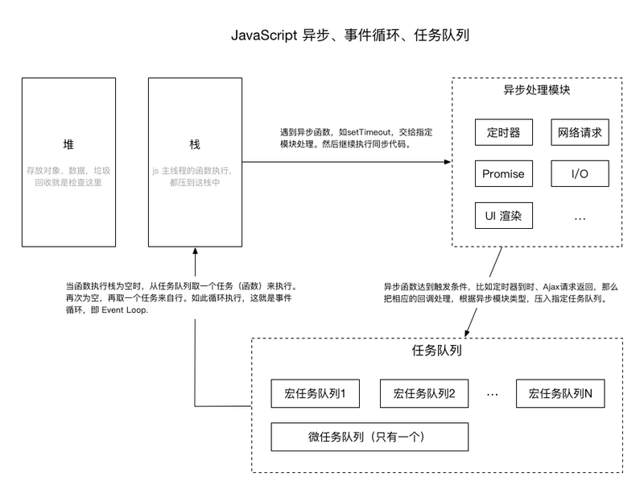

## 概览

## 任务队列

Js 中，有两类任务队列：宏任务队列（macro tasks）和微任务队列（micro tasks）。宏任务队列可以有多个，微任务队列只有一个。那么什么任务，会分到哪个队列呢？

- 宏任务：script（全局任务）, setTimeout, setInterval, setImmediate, I/O, UI rendering.
- 微任务：process.nextTick, Promise, Object.observer, MutationObserver.

## 执行顺序
先执行主线程，再取微任务，再取宏任务
