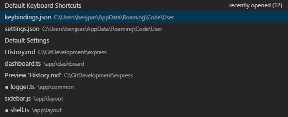

> [官方文档-代码导航](https://code.visualstudio.com/docs/editor/editingevolved)

## 主命令框
最重要的功能就是`F1`或`Ctrl+Shift+P`打开的命令面板了，在这个命令框里可以执行VSCode的任何一条命令，甚至关闭这个编辑器。
按一下`Backspace`会进入到`Ctrl+P`模式里
在`Ctrl+P`下输入`>`又可以回到`Ctrl+Shift+P`模式。
在`Ctrl+P`窗口下还可以直接输入文件名，跳转到文件

## 快速文件导航
在浏览项目时，Explorer非常适合在文件之间导航。但是，当您处理任务时，您会发现自己在同一组文件之间快速跳转。VS Code提供了两个功能强大的命令，可以通过易于使用的键绑定在文件中导航和跨文件导航。

按住`Ctrl`键并按`Tab`键查看编辑器组中打开的所有文件的列表。要打开其中一个文件，请再次使用`Tab`选择要导航到的文件，然后释放`Ctrl`以将其打开。

或者，您可以使用`Alt + Left`和`Alt + Right`在文件和编辑位置之间导航。如果您在同一文件的不同行之间跳转，这些快捷方式允许您轻松地在这些位置之间导航。

> 提示：键入`Ctrl + P`（快速打开）时，可以按名称打开任何文件。

## 转到定义

如果某种语言支持它，您可以按F12转到符号的定义。

如果按`Ctrl`键并将鼠标悬停在符号上，将显示声明的预览：

> 提示：您可以使用`Ctrl +单击`跳转到定义，或使用`Ctrl + Alt +单击`打开侧面的定义。

## 转到类型定义
某些语言还支持通过从编辑器上下文菜单或命令选项板运行“ 转到类型定义”命令来跳转到符号的类型定义。这将带您到符号类型的定义。命令`editor.action.goToTypeDefinition`默认情况下不绑定到键盘快捷键，但您可以添加自己的自定义键绑定。

## 转到引用
语言还可以通过按`Ctrl+F12`支持跳转到符号的实现。对于接口，它显示了该接口的所有实现者，对于抽象方法，这显示了该方法的所有具体实现。

## 转到符号
您可以使用`Ctrl+Shift+O`在文件内导航符号。通过键入：符号将按类别分组。按`向上`或`向下`键并导航到所需的位置。

## 按名称打开符号
某些语言支持使用`Ctrl+T`跨文件跳转到符号。键入要导航到的类型的第一个字母，无论哪个文件包含它，然后按Enter键。

## 窥视
我们认为没有什么比一个大的上下文切换更糟糕了，当你想要的只是快速检查一些东西。 这就是为什么我们支持偷看的编辑。 当您执行Peek References搜索（通过Shift+F12 ）或Peek Definition （通过Alt+F12 ）时，我们将结果嵌入到内联中：

您可以在窥视编辑器中的不同引用之间导航，并在那里进行快速编辑。 单击隐藏的编辑器文件名或双击结果列表将在外部编辑器中打开引用。

> 提示：此外，如果您按下`Escape`或在`peek`编辑器区域中双击，则会关闭查看窗口。您可以使用`editor.stablePeek` 设置禁用此行为。

##错误和警告
警告或错误可以通过已配置的任务，丰富的语言服务或者在后台不断分析代码的连接器(linters)生成。由于我们喜欢无错误的代码，警告和错误会出现在多个地方：

- 在状态栏中，有一个所有错误和警告计数的摘要。
- 您可以单击摘要或按`Ctrl+Shift+M`以显示“问题”面板，其中包含所有当前错误的列表。
- 如果打开包含错误或警告的文件，它们将与文本和概述标尺一起呈现。

> 提示：要循环显示当前文件中的错误或警告，可以按`F8`或`Shift+F8` ，这将显示详细说明问题的内联区域和可能的代码操作（如果可用）：

警告和错误可以提供代码操作（也称为快速修复）以帮助解决问题。 这些将作为灯泡显示在左边距的编辑器中。 单击灯泡将显示“代码操作”选项或执行操作。

## 查找替换

- 查找 Ctrl+F
- 查找替换 Ctrl+H
- 整个文件夹中查找 Ctrl+Shift+F
- 匹配符：
  - \* to match one or more characters in a path segment
  - ? to match on one character in a path segment
  - ** to match any number of path segments ,including none
  - {} to group conditions (e.g. {\*\*/\*.html,\*\*/\*.txt} matches all html and txt files)
  - [] to declare a range of characters to match (e.g., example.[0-9] to match on example.0,example.1,…

## 插件

### Bookmarks

这是一款给文件打上书签, 方便快速跳转的插件

| 常用快捷键 | 效果             |
| ---------- | ---------------- |
| ctrl+alt+k | 添加或取消标签   |
| ctrl+alt+j | 跳转到上一个标签 |
| ctrl+alt+l | 跳转到下一个标签 |

