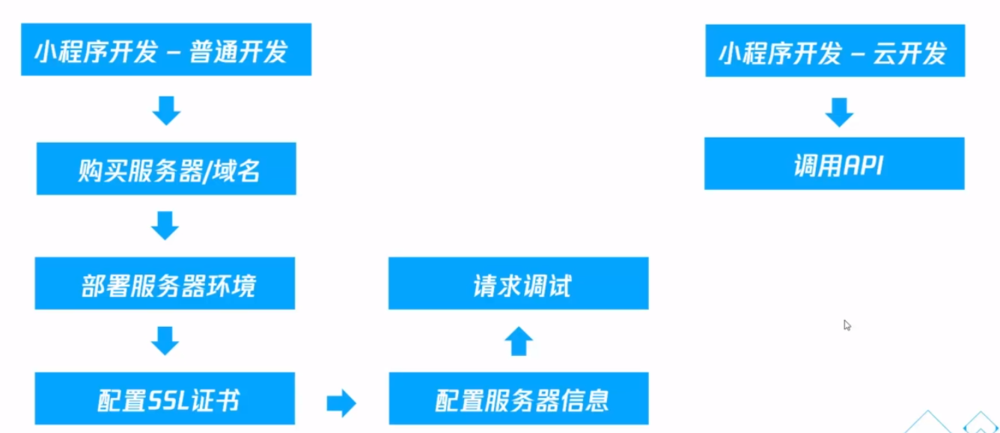

> [云开发文档](https://developers.weixin.qq.com/miniprogram/dev/wxcloud/basis/getting-started.html)
> 
> [云学院教程](https://cloud.tencent.com/developer/edu/courses?cid=10029)

## 云开发介绍
传统小程序需要架构完整的小程序请求端来对数据进行处理, 对开发者的运维要求比较高.

云开发为开发者提供完整的云端支持，弱化后端和运维概念，无需搭建服务器，使用平台提供的 API 进行核心业务开发，即可实现快速上线和迭代，同时这一能力，同开发者已经使用的云服务相互兼容，并不互斥。

## 云开发基本能力
- 数据库：一个既可在小程序前端操作，也能在云函数中读写的 JSON 数据库
- 存储：在小程序前端直接上传/下载云端文件，在云开发控制台可视化管理
- 云函数：在云端运行的代码，微信私有协议天然鉴权，开发者只需编写自身业务逻辑代码

## 云开发流程
1. 点击IDE云开发按钮开通
2. 初始化
3. 开发(调用api,使用云服务)
4. 上传发布

## 云开发项目初始化
- cloudfunctionRoot 方法存储云函数
- wx.cloud.init 方法初始化函数
- env 定义服务默认环境

### cloudfunctionRoot

`project.config.json` 中增加了字段 `cloudfunctionRoot` 用于指定存放云函数的目录

云开发能力从基础库 2.2.3 开始支持, 如果兼容之前的版本, 要在 `app.json` 中添加 `"could":true` 字段

### wx.cloud.init

在小程序端开始使用云能力前，需先调用 `wx.cloud.init` 方法完成云能力初始化（注意小程序需先开通云服务，开通的方法是点击工具栏左上角的 “控制台” 按钮）。因此，如果要使用云能力，通常我们在小程序初始化时即调用这个方法。

### env

`env` 是 `wx.cloud.init` 的一个参数
开通云开发之前会分配两个环境, 一般一个作为正式环境, 一个作为测试环境

## 基本操作

### 云数据库

简而言是, 就是 `MongoDB`.

有方便的权限管理
| 模式                                   | 小程序端 读自己创建的数据 | 小程序端 写自己创建的数据 | 小程序端 读他人创建的数据 | 小程序端 写他人创建的数据 | 管理端 读写任意数据 |
| -------------------------------------- | ------------------------- | ------------------------- | ------------------------- | ------------------------- | ------------------- |
| 仅创建者可写，所有人可读               | √                         | √                         | √                         | ×                         | √                   |
| 仅创建者可读写                         | √                         | √                         | ×                         | ×                         | √                   |
| 仅管理端可写，所有人可读               | √                         | ×                         | √                         | ×                         | √                   |
| 仅管理端可读写：该数据只有管理端可读写 | ×                         | ×                         | ×                         | ×                         | √                   |

### 云存储
- wx.cloud.uploadFile 上传文件
- wx.cloud.downloadFile 下载文件
- wx.cloud.deleteFile 删除文件
- wx.cloud.getTempFileURL 换取临时链接

### 云函数

[详情见文档](https://developers.weixin.qq.com/miniprogram/dev/wxcloud/guide/functions/getting-started.html)

云开发的云函数的独特优势在于与微信登录鉴权的无缝整合。当小程序端调用云函数时，云函数的传入参数中会被注入小程序端用户的 `openid`，开发者无需校验 `openid` 的正确性，因为微信已经完成了这部分鉴权，开发者可以直接使用该 `openid`。与 `openid` 一起同时注入云函数的还有小程序的 `appid`。

从小程序端调用云函数时，开发者可以在云函数内使用 `wx-server-sdk` 提供的 `getWXContext` 方法获取到每次调用的上下文（`appid`、`openid` 等），无需维护复杂的鉴权机制，即可获取天然可信任的用户登录态（`openid`）。

- [TCBRouter](https://www.npmjs.com/package/tcb-router) koa风格的路由, 云函数只能使用20个, 通过TCBRouter可以解决这个问题
- 可以简单对接模板消息
  - 每一次 form 表单提交时可以获取到用于发布模板消息的 from_id
  - from_id 仅能推送一次模板消息
  - 支付后, 使用 prepay_id 可以推送三次模板消息

## demo

