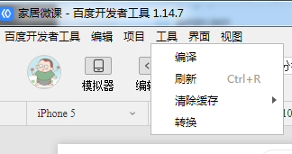

## 开发工具转换

登录百度小程序开发工具，在工具菜单，有一个一键转换微信的小程序为百度小程序。（前提：有审核通过的appid，并且登录开发者工具）



## npm 工具

[wx2swan](https://github.com/yican008/wx2swan)

```
// 安装： 
npm i -g wx2swan

// 转换：
// wx2swan 微信小程序的目录 (生成swan的目录)
wx2swan ./test/demo ./test/swanDemo
```

## 手工转换

[微信小程序如何转换成百度小程序1](http://www.pweb123.com/2018/swan_1020/752.html)

[微信小程序如何转换成百度小程序2](http://caibaojian.com/baiduapp-vs-weixinapp.html)

> 参考链接 
> 
> [微信小程序如何转换成百度小程序1](http://www.pweb123.com/2018/swan_1020/752.html)
> 
> [微信小程序如何转换成百度小程序2](http://caibaojian.com/baiduapp-vs-weixinapp.html)